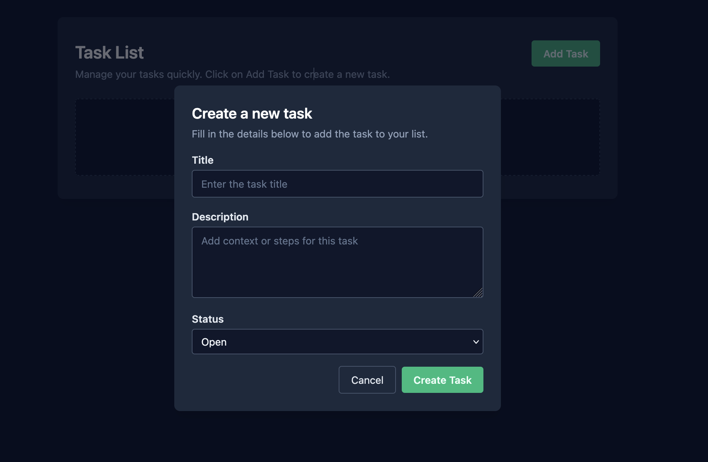

# to-do-app-for-DSP

small To-Do app just to practice basic web programming for the selection process to work on DSP as a student employee

minimalist Front End:

<video src="demo.mp4" width="600" controls>
  Your browser does not support the video tag.
</video>

in order to run the front end (from folder frontend):
    npm run dev
    http://localhost:5175/

in order to run the Back end (from the folder backend/todo):
    python manage.py runserver
    http://localhost:8000/api/todos/

command line:
    install dependencies: pip install -r requirements.txt
    
    migration:
        python manage.py makemigrations
        python manage.py migrate

